summary: Why Developers Love Dynatrace - Episode 1
id: why-devs-love-dynatrace-1
categories: codelevel, cicd, qualitygates
tags: codelevel
status: Published
authors: sergio.hinojosa
Analytics Account: UA-193960361-1

# Why Devs Love Dynatrace - Episode 1

## Agenda

Positive
: ***In this Developer Webinar Series we want to bring you from Zero 👶 to Hero 🦸 from Diagnosing Transactions and releases with Dynatrace to building unbreakable delivery pipelines with automatic performance tests and release validation alongside fullstack comparison.***

**Watch the recording of Episode 1 on YouTube!**


Dynatrace assist developers on creating **better software faster**. This series is crafted for developers and performance engineers on helping them get the feedback they need and analyze the impact of every code change on every release. We will also learn how automated and intelligent QualityGates and Performance as a Self-Service stop bad releases going into production automatically.

Positive
: This systematic and generic approach can be applied to any software that Dynatrace monitors and any CI/CD pipeline that our customers may use, meaning we can speed up 🚀 their delivery up to 80% while ensuring the functionality and a higher level of quality of their released software ✅.


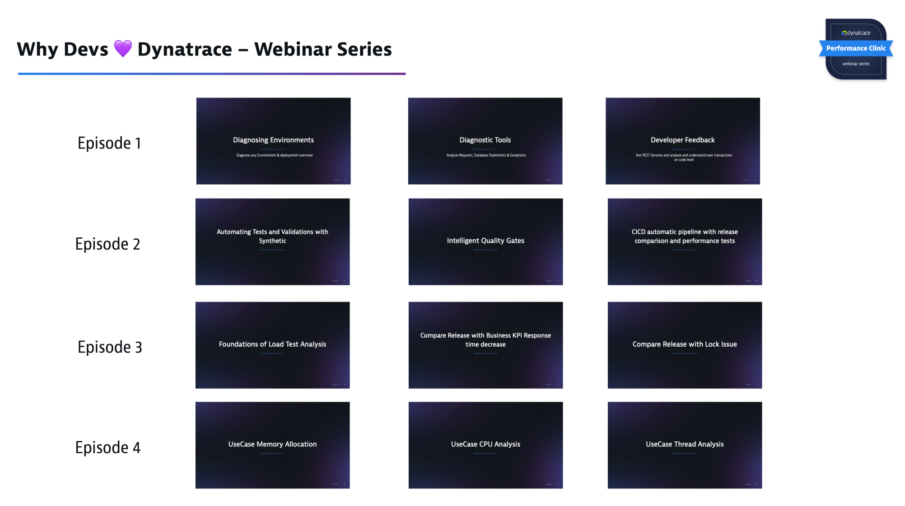

Some of the topics you will learn:
- Help you become more comfortable using Dynatrace to diagnose application problems, understand the service dependencies, the architecture and know how and where to optimize.
- Help you diagnose the overall health of an environment from thousands of services all the way to threads, exceptions and response times of a single transaction end-2-end through all layers (FullStack)
- Get Feedback on Transactions for Developers
- Do a Top Down-analysis and Bottom-Up (on single or multiple transactions)
- Understand the added-value for developers to have an automated qualitygate in the CI/CD pipeline.
- Make the diagnosis easy for others in your organization
- Not everybody needs to be a “Dynatrace Expert”
- Understand how you can leverage Davis so she helps you monitor and diagnose applications.
- Understand the value of automatic quality gates with performances as a self-service
- Best Practices for automatic loadtesting and quality gates. How to build SLI/SLOs for continuous release comparison. 
- Integrate, compare and analyze Loadtests with Dynatrace
- Compare and analyze GarbageCollection, Memory Allocation, Survived Objects, ThreadGroups & blocking Threads as well as CPU Utilization for loadtests or any ondemand analysis for that matter.

## Introduction 
Duration: 10

Positive
: As a developer you are asked to create high quality software faster. Fullstack Observability and automated distributed tracing with code level visibility give you all the data you need to analyse and understand response time hotspots, cpu and memory usage, errors and exceptions, service dependencies, synchronization and thread issues, inefficient database calls, problematic libraries or impact of 3rd party components.


>In Episode 1 of this Performance Clinic Series, we will show you hands-on on how you can use Dynatrace in your development & test environments to automate observability and analysis of your applications & services. We will learn how to analyse problematic transactions in complex & hybrid distributed systems. We will dive into easy access of your distributed traces (we call them PurePaths) and how Dynatrace automatically shows the hotspots so that you can easily optimize or fix them.

In Episode 1 we will learn how to:
- Easy start with Dynatrace in Development & Integration environments 
- Analyze big & complex environments
- Enhance Developers FeedBack with distributed tracing and code level insights
- Analyze and identify developer transactions (or any kind of transaction)

## Dynatrace & the OneAgent for Devs in a nutshell
### Dynatrace Secret Sauce
Positive
: 

### Observability and so much more
Positive
: 

### Features for Developers in a nutshell
Positive
: 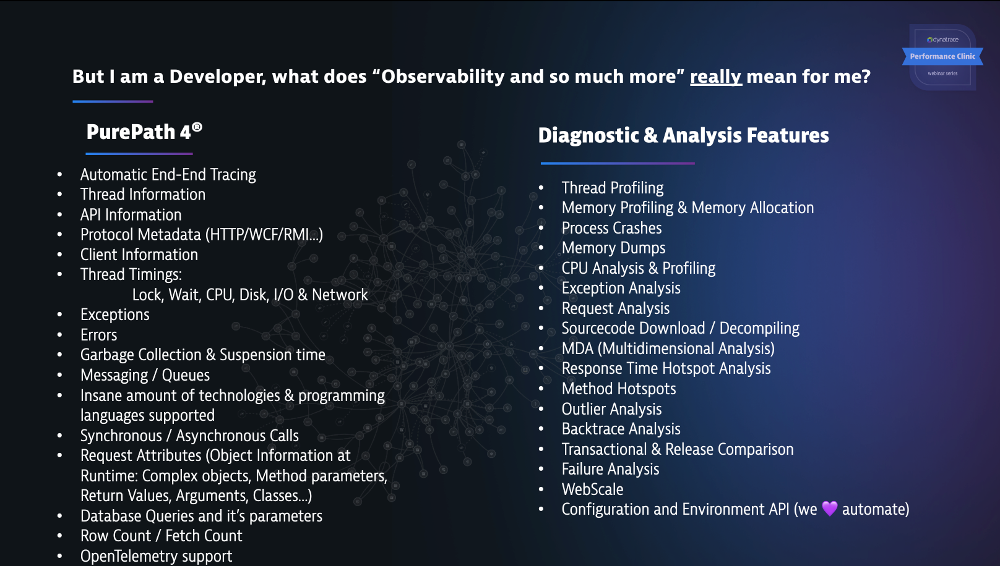

## Installing the OneAgent & Easytravel

The environment we want to analyze consists of a booking travel portal with a mix of technologies. A mix of Legacy and Classic Stack and also some new stack running on containers. You just need an ubuntu machine to spin it up.

Positive
: Spend more time innovating 😄⚗️ and less time configuring 😣🛠

Positive
: You have to bring your own Dynatrace tenant. If you don't have a Dynatrace tenant yet, sign up for a [free trial](https://www.dynatrace.com/trial/) or a [developer account](https://www.dynatrace.com/developer/).

### Download install script
>Download help script to install Easytravel, Nginx, Docker the OneAgent and other utils	
```bash
wget https://raw.githubusercontent.com/dynatrace-perfclinics/why-devs-love-dynatrace/main/easytravel/ubuntu-setup-easytravel.sh
```
### Add your Dynatrace credentials
Positive
: We want that the script installs the OneAgent before installing easyTravel and the docker containers. We just need to add the variables at the beginning.

```bash
## Set DT_TENANT_URL and API TOKEN
# ---- Define Dynatrace Environment ----
# Sample: https://{your-domain}/e/{your-environment-id} for managed or https://{your-environment-id}.live.dynatrace.com for SaaS
DT_TENANT_URL=
DT_PAAS_TOKEN=
```
### Execute the script
```bash
sudo bash ubuntu-setup-easytravel.sh -i
```

Positive
: If you want to learn more about how this script is composed and setting up easytravel, it's endpoints and everything that is installed, check out the codelab [Deploying Easytravel @ 127.0.0.1](https://dynatrace-perfclinics.github.io/codelabs/deploy-easytravel-at-localhost) 

## Environment Configuration (MonACo)

Monaco stands for `Monitoring As Code`. In Dynatrace we love to automate. With monaco we can automate the configuration of one or multiple environments following a GitOps approach. 

Positive
: Spend more time innovating 😄⚗️ and less time configuring 😣🛠


Positive
: Having an environment where automatically every Host, Process, Namespace, Transaction etc... gets categorized automatically (via automated tagging) is a ver powerful and useful approach that should be used on every DevOps practice. With Dynatrace you can use filters and chain of filters to find the needle in the haystack in a matter of seconds.

We will import the following configurations following a GitOps approach:

- [Management Zones](https://www.dynatrace.com/support/help/how-to-use-dynatrace/management-zones/) 
- [Automated Tagging](https://www.dynatrace.com/support/help/how-to-use-dynatrace/tags-and-metadata/setup/how-to-define-tags/#automated-approach)
- [Request Attributes](https://www.dynatrace.com/support/help/how-to-use-dynatrace/transactions-and-services/basic-concepts/request-attributes/)
- [Dashboards](https://www.dynatrace.com/support/help/how-to-use-dynatrace/dashboards-and-charts/dashboards/create-dashboards/)
- [Application Definition](https://www.dynatrace.com/support/help/how-to-use-dynatrace/real-user-monitoring/setup-and-configuration/web-applications/initial-configuration/define-your-applications-via-the-my-web-application-placeholder/)

### Download Monaco
[Dynatrace Monitoring as Code](https://github.com/dynatrace-oss/dynatrace-monitoring-as-code)

Download the [latest release (depending the architecture of your OS)](https://github.com/dynatrace-oss/dynatrace-monitoring-as-code/releases/latest) and add the binary to your path.

### Check that you can execute the binary
```bash
monaco --help
```
### Clone the GitOps configuration
```bash
git clone https://github.com/dynatrace-perfclinics/why-devs-love-dynatrace
```

### Navigate to the GitOps directory
```bash
cd why-devs-love-dynatrace/monaco/devlove 
```

### Add your variables to a helper script `set_dt_variables.sh`
```bash
vi set_dt_variables.sh
```

```bash
# Sample: https://{your-domain}/e/{your-environment-id} for managed or https://{your-environment-id}.live.dynatrace.com for SaaS
DT_TENANT_URL=
# https://www.dynatrace.com/support/help/shortlink/token#create-an-api-token-
# Token in format dt0c01.STXXXX....
DT_API_TOKEN=

# DT_USER (Your login username in the environment, Click on the top right on the people icon and see your id, it can be your email or a username)
DT_USER=
```

Negative
: The variables will be exported as environment variables.

### Load the variables in the shell
```bash
source set_dt_variables.sh
```
### Execute Monaco

```bash
monaco deploy -e environment.yaml --project episode1 -v
```
##  Diagnosing any Environment 

### Understanding the Performance of any Environment
Positive
: Leveraging automated tagging and management zones you can get very fast and easy an understanding of user experience, transactions, hosts, application network traffic, failures on specific stages, regions, datacenters, namespaces, departments, subcompanies, etc.


In this Performance Overview Dashboard you can see:

- the amount and health of databases, services, hosts and applications.
- amount of requests vs responsetime 95th percentile
- Network status
- HTTP errors and failed transactions
- Database calls and time spent in database per transaction
- most failing services 
- service throughput
- slowest services
- database calls per service
- time transactions spent in database
- service time spent in wait, lock, IO and CPU
- JVM CPU by ThreadGroup
- GC by Poolname
- Memory Allocation Objects by API


Positive
: Click on the Management Filter (Top right) Filter by EasyTravel or BankJob. See how the Dashboard automatically adapts to the entities filtered.

## Deployment overview

For getting a quick understanding on what is deployed on an enviroment, I recommend to start with the following sections:

### Technologies
Positive
: Click on Technologies (either on) the link of the dashboard or expand the left menu > technologies


Negative
: In this screenshot your might find more technologies since we have a Developer Kubernetes Cluster deployed from Episode 2.
 
### Applications
Get an understanding on the real users accessing the defined applications.


### Smartscape
Positive
: Get an understanding on the dependencies and all the layers of the deployed & monitored technologies. Hosts running on Datacenters, processes running on hosts, services (transactions) running on each process and users (applications) interacting with those services. **Tip: use the management zone filter to check corresponding entities.** 

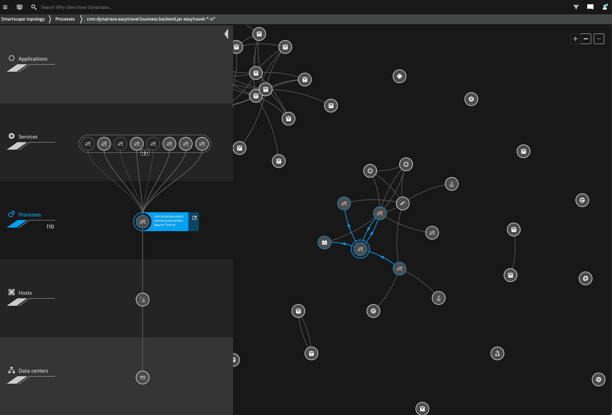

## Basic Diagnostics

### Diagnostic Tools 🔬🩺

Positive
: [Learn more about Diagnostic Tools](https://www.dynatrace.com/support/help/how-to-use-dynatrace/diagnostics/)


Negative
: Some of the Diagnosis excercises will differ from your environment since in Episode 2 we will create a continuous delivery pipeline and deploy different releases of EasyTravel. The releases will be automatically load tested, compared and evaluated with an intelligent quality gate. For learning how to work with filters and chain of filters we don't need to build the pipeline at this moment.

## Diagnostics - Requests 

Positive
: Click on Top web requests. This will open a Multidimensional Analyis of all top requests. 

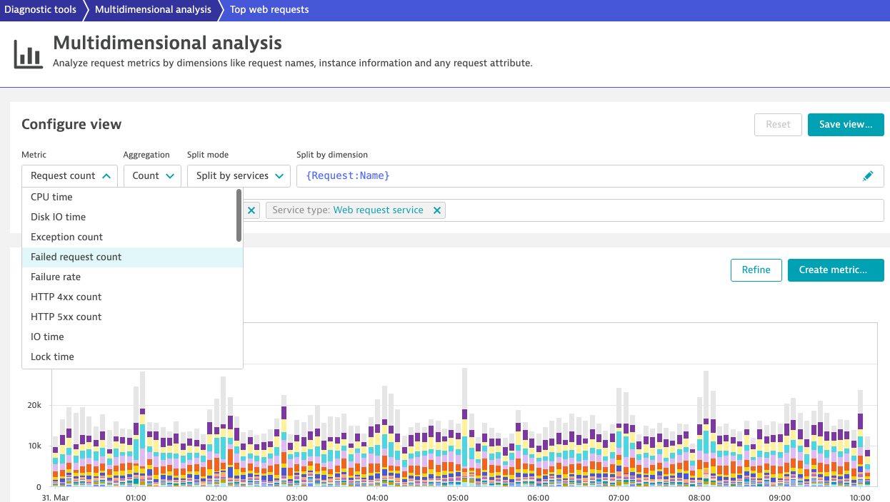

Positive
: Notice how you can change the **splitting criterias**, **split mode**, the **aggregation** and the **metric** to plot the dimension. 

*We will search for the following transactions:*
### 🔎 Only failed transactions


### 🔎 Transactions with more than 10 seconds over the last 6 hours


Positive
: By changing the Metric to **Reponse time**, **Aggregation** to Maximum you get an understanding of the slowest requests on the queried time.

### 🔎 Transactions calling dynatrace.com 


Positive
: By clicking on on the 3 dots, an analysis menu for the selected requests opens. By Clicking for example on the **service backtrace**, you can trace the requests back to it's origin.

### 🔎 Transactions that makes more than 100 database calls.

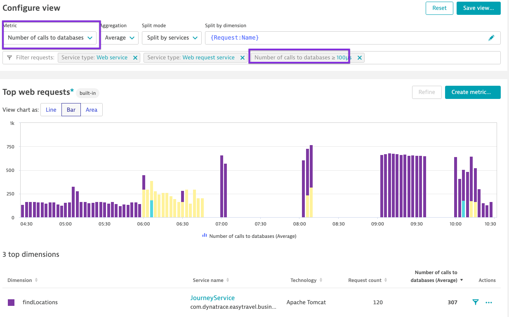

### 🔎 Transactions with Lock issues

Negative
: Plotting by **Lock time** & aggregation **maximum** shows you the time a transaction spends in Lock time. Meaning the Thread is bloqued and can't continue doing it' job.


## Diagnostics - Database Statements
Positive
: Click on Top Database statements. This will open a Multidimensional Analyis of all database statements. 

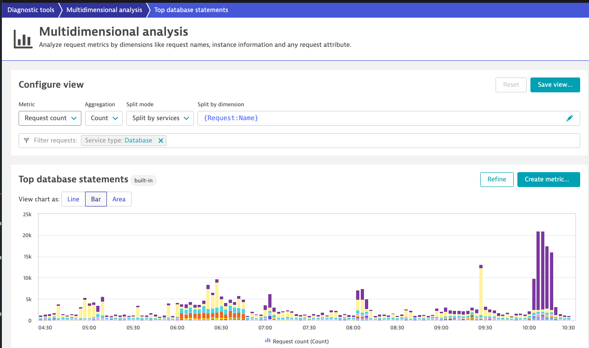

### *We will search for the following transactions:*

### 🔎 Do we have failing  database statements?


Positive
: There is no match which means there are no failed database statements. Which is good. o you have failed database statements or failed requests in your environment?

### 🔎 Which is the slowest database transaction of the day? **Continue analysing with the outliers** Detect the slowest execution and understand from where was this SQL triggered.

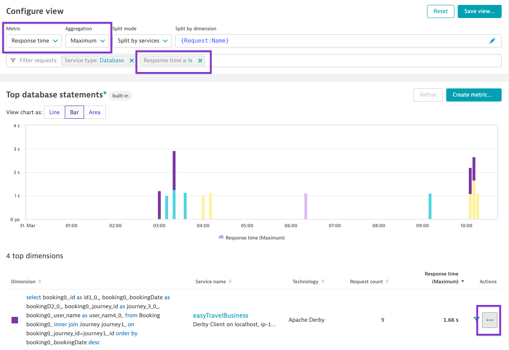

Positive
: We plot by **response time** and **maximum** and we continue filtering by adding an operand for **> response time**. Then we select the slowest SQL and Click on **Outliers**.


Positive
: Here we get an understanding of the distribution of the transactions. Then on the 3 dots, we do a **backtrace** to understand who triggered this SQL.

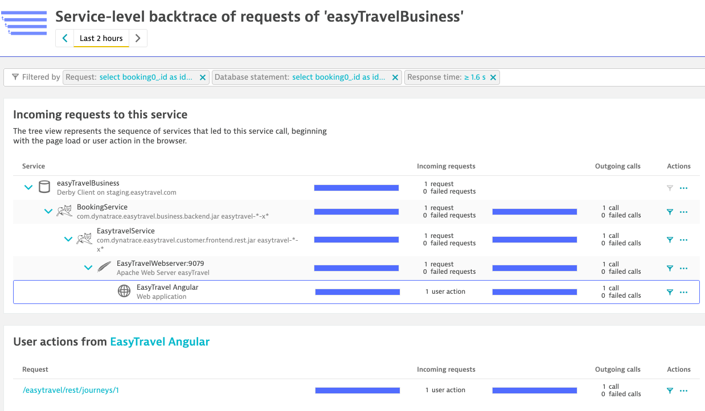

Positive
: On the backtrace we notice that this transaction is coming from **EasyTravel Angular** from the request endpoint `/easytravel/rest/journeys/[1-9]`.


### 🔎 Which SQL hast the most Fetch count and wich the most Row count? Where is this transaction coming from? Which application and which user action is triggering this SQL?


Positive
: On the backtrace we notice that this transaction is being triggered directly from the AuthenticationService. By clicking on each node you get details of those transactions. here we see the different Methods (requests) and its amount that are triggering such an SQL to the Database. You can also check the instances and validate if the loadbalancing is done properly and which instance (container, pod, etc..) did that transaction at a specific time.

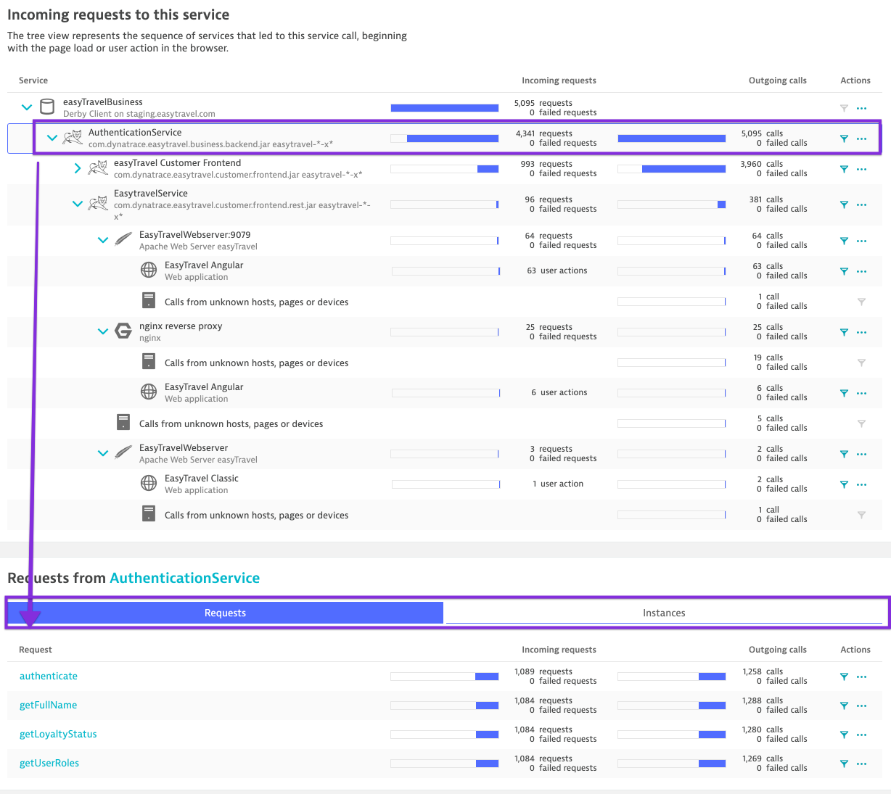

## Diagnosis - Exceptions

Negative
: **Protip:** ⚠️ Exceptions are expensive and can cost unnecessary memory and CPU consumption. Having the ability to sort them by amount, impact and impacted services allows you to assign them to tickets in your **Backlog**. Making your application continuously better.

*We will search for the following transactions:*

Positive
: Click on Exception Analysis. 

### 🔎 All Exceptions of the day


### 🔎 Failed exceptions


Positive
:  Dynatrace has the ability to configure custom error detection for your services. If there is an BusinessException where you want to mark the transation failed so the failurerate increases, you can do this in the <a href="https://www.dynatrace.com/support/help/how-to-use-dynatrace/transactions-and-services/configuration/configure-service-error-detection/" target="_blank">service error detection</a>.


Positive
: **Let 👧 🧠 DAVIS work for you!**

<!-- TODO Add Davis Image
-->

## Developer Feedback and Manual Testing


Positive
: In this section we will see how developers can get feedback on real time from any environment, test, development, integration or even production systems.

## Dev Feedback - REST Sign-In

### REST Sign-In (Create Account) EasyTravel

We are asked to test the REST Sign-In and Login functionality of Easytravel. To understand the flow of the transaction, response time and architecture. We are only given the REST Endpoint where `{{custom.easytravel_ip}}` is the IP where easyTravel is deployed. 

```bash
POST http://{{custom.easytravel_ip}}/easytravel/rest/signin
```

JSON Body
```json
{
    "firstName": "{{custom.developer_name}}",
    "lastName": "{{custom.developer_name}} LastName",
    "email": "{{custom.developer_name}}",
    "password": "{{custom.developer_name}}",
    "state": "Bayern",
    "city": "Munich",
    "street": "Main Street 1",
    "door": "",
    "phone": "+49123456789"
}

```

We are going to pass the following attributes into the POST request.
```bash
HTTP Headers:
Content-Type: application/json
x-developer: yourname
```

Positive
: Notice the `x-developer` header. This parameter is automatically captured in the environment. We deployed this request attribute previously with monaco.

For this excercise you can use cURL, VisualCode, Postman or any REST tool of your choice. Here is an API Test already preconfigured for you <a href="https://apitester.com/shared/checks/1e9c26fe152648adace2db35aaa2a6f6" target="_blank">🚦 API TEST Template for SingIn</a>


- The test consists of basically 2 steps, POST request and an assert.
- Modify the X-Developer Header with **your_name_identifier**.
- This value will be used as email and password for the creation of the SignIn. (just for keeping things simple)

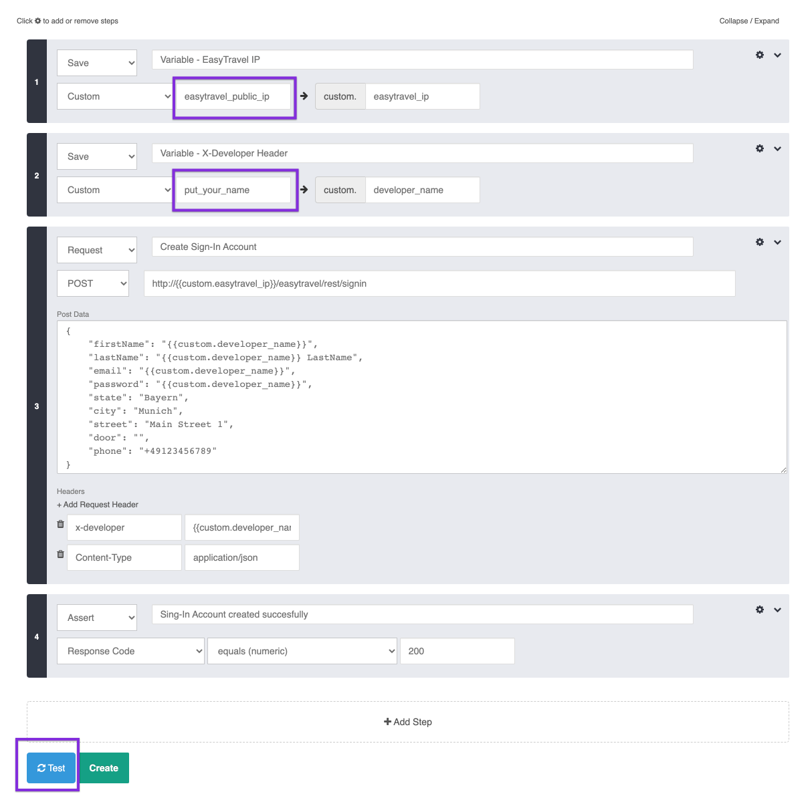

### Create an Account via REST


Positive
: Click on **Test**

Positive
: It should pass all 4 steps. 


Positive
: On the response you see it returns a JSON with the Account details and a RC 200.


Negative
: Now, click on **Test** again. Yes, with the same data. Let‘s try to create the same Sign-In Account. 

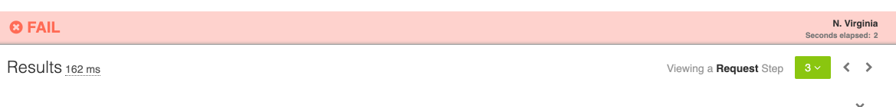

Negative
: The test should fail. What error code did you get?

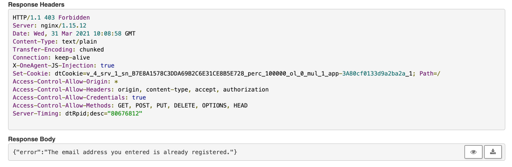

Negative
: You should see a ResponseCode 403 and the following error message:

```json
{"error":"The email address you entered is already registered."}
```


## Dev Feedback - REST Log-In

### REST Login (Log in to the created account)  EasyTravel

Before we analyse the transactions in Dynatrace, let's test that we can create a Login with the created Account.

The endpoint is the following:
```bash
POST http://{{custom.easytravel_ip}}/easytravel/rest/login
```

JSON Body
```json
{
    "username": "{{custom.developer_name}}",
    "password": "{{custom.developer_name}}"
}
```
#### Login via REST
- Open the test <a href="https://apitester.com/shared/checks/09c76ef3a75e45ed8a9547996f6d0198" target="_blank">🚦 API TEST Template for Login</a>

- Modify the developer name with your_name to the name where you created the account
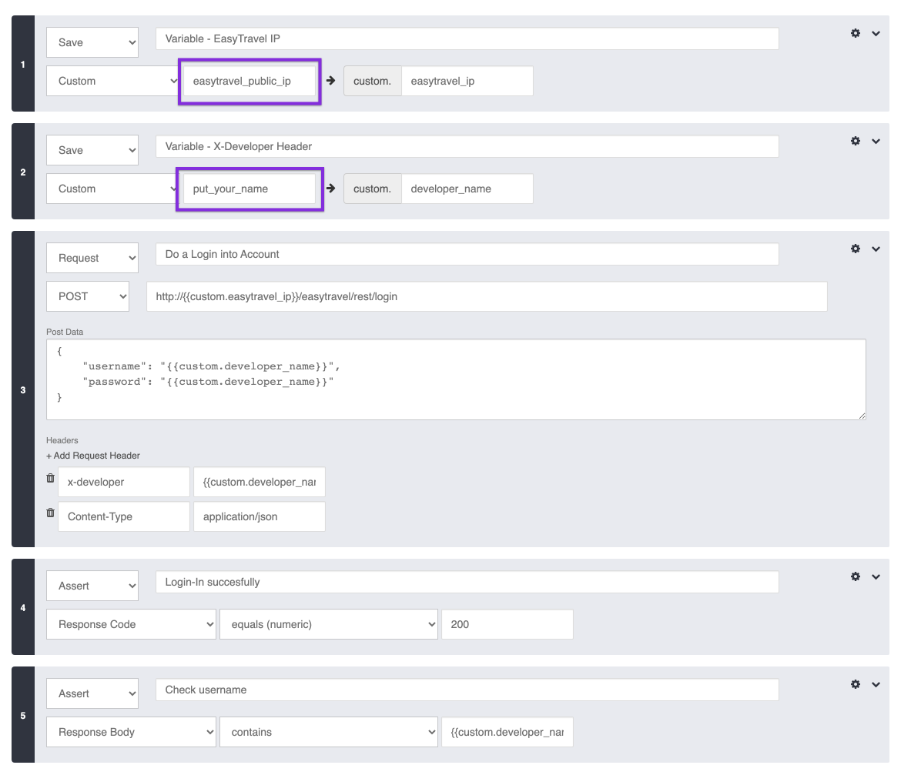

- Click on Test
- You should have a succesfull test and the reponse returns the entered data from the Account.


## Dev Feedback SignIn in Dynatrace

#### MDA FeedBack Developer
- Go to MDA and search the request by `{RequestAttribute:Developer}`


*You'll find your request for each transaction twice, but on an Apache Tomcat and on an NGINX. The NGINX (which is running in a docker container) works as a reverse proxa and forwards all headers, hence Tomcat also captures the `x-developer` header. pretty easy to understand by showing the service flow or backtrace.*


- Filter your SignIn requests and show the Service-Flow from the NGINX service. 
 


Remove the filter of the `sign` request. When removing the request type you'll notice the 3 distributed trace of your requests (2x signin + 1x login).

Positive
: Dynatrace is showing the average response time of the 3 requests and the intertiercalls to each service. The Response Time contribution is dependent of the selected transactions. By selecting a service (node) of the distributed transactions on the right you'll get an overview of the passing transactions and also the corresponding infrastructure, meaning if you have for example multiple replicasets of a deployment you can filter and see exactly which transactions passed through which container (process) inside a pod. 


Now let's filter the transaction of the correct Account creation. Add a `response code:200` and `request:sign`


Now on the NGINX Service we click **Analyze** and go to the **Response time hotspots**. I like to think that I submerge into the service and navigate inside the service.


Inside the Response Time hotspots Dynatrace shows us the average time of the selected transactions on the NGINX service. The distribution of its transactions (we have only one here) and the top findings. 


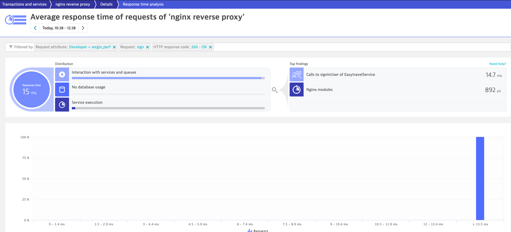

We see that the most of the time is spent on interaction with other services which is the Method `signUser` on the EasyTravel Service. We click on the filter to navigate forward.

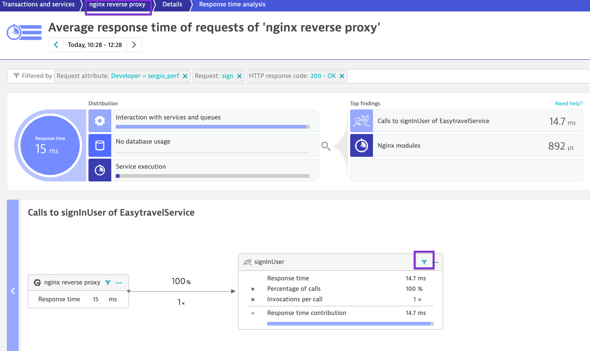

Notice how we **jumped** into the next service. Imagine that you are navigating within the distributed transactions and now you find yourself on the next service.


Notice how we start adding a chain of filters into the analysis and we navigate through the services. Now the time changed to 13.9 ms because we are in the **EasyTravelService.** From those 13.9ms, 8 milliseconds are spent on code execution whitin this service (java code since its a tomcat) and 5.82 ms in calls to `addNewUser`in the `AuthenticationService`. We click on the filter on the `addNewUser`in the `AuthenticationService` to jump to the next service.


Now we find ourselves in the AuthenticationService. The timings adapt and we see the information for this transaction and this service. By clicking to the Database we see there were 8 request = 4 Connection Aquisitions + 2 SQL Statements (1 x Select + 1 x Insert ) + its corresponding 2 Commits.

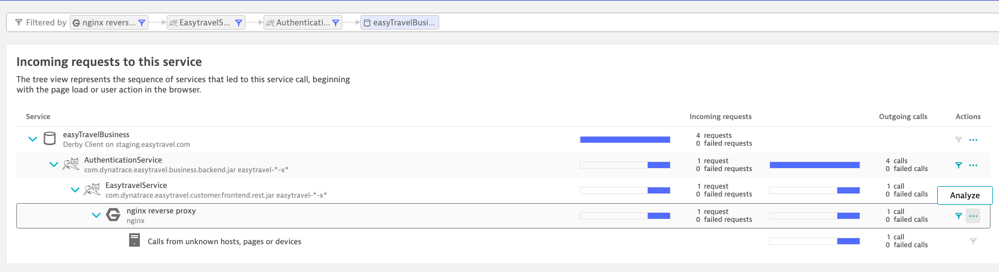


Now let's show the Purepath so we understand how we navigated. Scrolldown and click on Backtrace and on the NGINX node, click on **Analyze > Purepaths**. 


Now it's showing us the purepath from the nginx as start (distributed trace with all it's spans and code insights). On the dropdown on the right, show the HTTP request data. Now we remove the filter of the **response code 200** on the NGINX node and click **apply**. What happens?

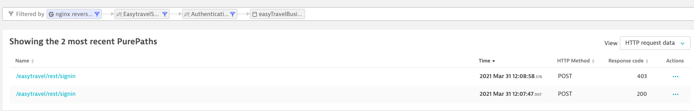

It's also showing us the transaction that failed. 

If you compare them you'll notice that the one that succeded (besides having the response code 200 which is obvious) has an insert statement.


This is due the fact that the previous select statement (select user...) does not find the account hence is able to insert a new account in the database. 


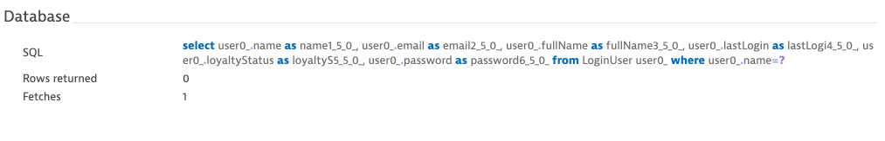

The subsequent account creation returns a row hence the double account can't be created.


The rows returned can also be seen for both transactions by displaying the purepaths from the database node.


## Dev Feedback REST Login in Dynatrace

#### Service-flow Login
- Now show the flow of your Login.
- Notice again the intertier-calls how they add up, the contribution of each service and the infrastructure where it’s running.

<!-- 
TODO

-->
#### ResponseTime Hotspots Login
Open the ResponseTime Hotspots from the ReverseProxy. Notice the contribution from Tomcat the Calls to AuthenticationService (4x) and VerificationService (1x)

Notice the contribution by Method within the AuthenticationService and how it can tell us which method is taking the most time within a single transaction (even though we are moving in 2 digit ms time)

## Feedback

Positive
: We hope you enjoyed this lab and found it useful. We would love your feedback!
<!-- 
TODO Add formular to track user engagement. See this as an example: https://dynatrace-apac.github.io/
-->

<form>
  <name>How was your overall experience with this lab?</name>
  <input value="Excellent" />
  <input value="Good" />
  <input value="Average" />
  <input value="Fair" />
  <input value="Poor" />
</form>

<form>
  <name>How likely are you to recommend this lab to a friend or colleague?</name>
  <input value="Very Likely" />
  <input value="Moderately Likely" />
  <input value="Neither Likely nor unlikely" />
  <input value="Moderately Unlikely" />
  <input value="Very Unlikely" />
</form>


