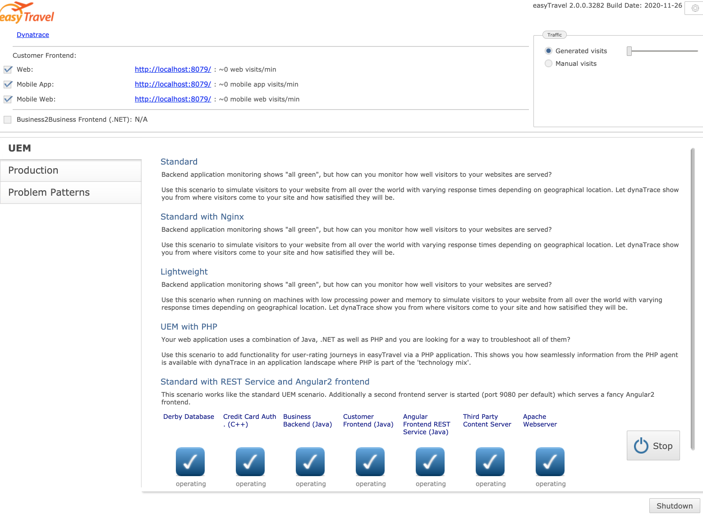
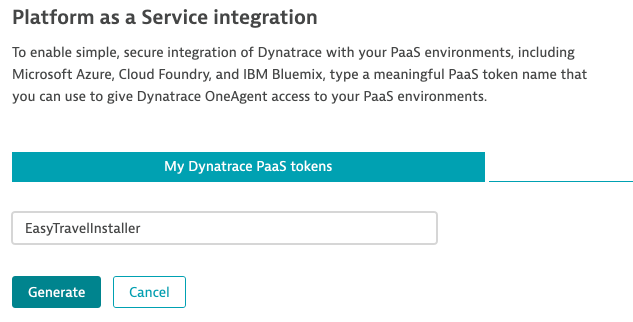
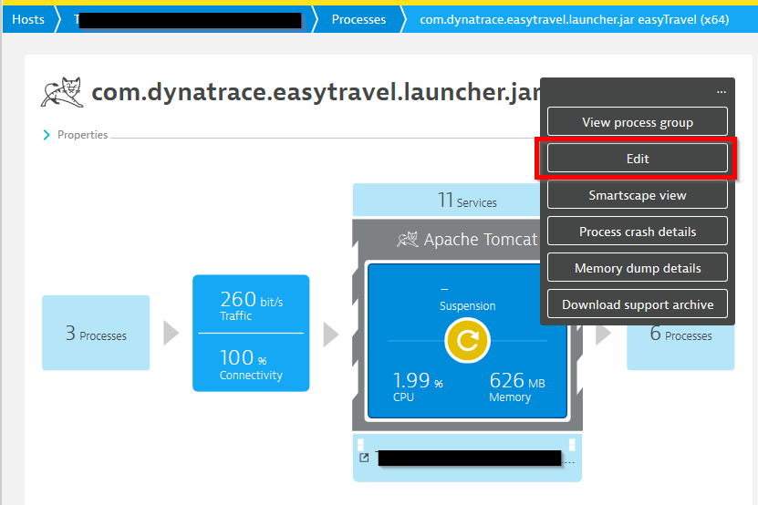
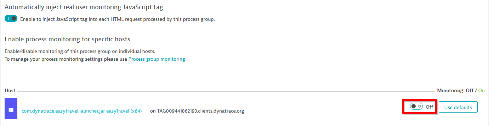

summary: Deploy Easytravel @ 127.0.0.1
id: deploy-easytravel-at-localhost
categories: easytravel, DEM, localhost
tags: easytravel
status: Published
authors: sergio.hinojosa
Analytics Account: UA-193960361-1
# Deploying Easytravel @ 127.0.0.1

## Introduction 
Duration: 1

for learning, and playing around there is nothing better than having a separate VM that you can break. This can be either an instance in a cloud provider or a virtual machine @ localhost. On your working station you can use a docker container with an ubuntu image or [https://multipass.run/](https://multipass.run/). Multipass is a great way to instantiate Ubuntu VMs and runs on Linux, Mac and Windows. it's made by the Ubuntu team highly optimized. 

In this Codelab we will learn how to spin a machine on Multipass and run easytravel and the Dynatrace OneAgent in there. 

Positive
: Spend more time innovating 😄⚗️ and less time configuring 😣🛠

<table style="width:100%;">
  <tr>
    <td></td>
    <td></td>
  </tr>
  <tr>
    <td> </td>
    <td> </td>
  </tr>
</table>


Positive
: ⏰ This tutorial is dynamic, meaning the time calculated depends on the customization you provide. The most common customizations are reflected in its own steps. As you go along on this tutorial you'll find `recommended`⦿ and `optional`○ steps which you'll be able to skip if not desired. 

|            |            |
|------------|------------|
| Recommended|     ⦿      |
| Optional   |     ○      |


## Get your VM ( ○ Multipass)
Duration: 5

Positive
: In this section we will explore how to create a VM on [multipass](https://multipass.run/)! a great way for spinning instant Ubuntu VMs in Windows, Mac or Linux computers. You can also use the cloud provider of your choice.

Negative 
: You can skip this section f you have already a VM. Or you can get one from the ☁️ Cloud. Don't have a VM or a Cloud Account? Don't worry, here you can sign for a free tier in [Amazon Web Services](https://aws.amazon.com/free/), [Microsoft Azure](https://azure.microsoft.com/en-us/free/) or [Google Cloud](https://cloud.google.com/free)

### Download & Install Multipass on your OS
Download multipass and install it depending on your OS [https://multipass.run/](https://multipass.run/)

### Show the help
```bash
multipass -h
```

###  Create a VM with x size
```bash
multipass launch --name <vm-name> --mem 4G --disk 10G --cpus 2
## e.g. for easytravel 
multipass launch --name easytravel --mem 4G --disk 10G --cpus 2
```

###  Start the VM	
```bash
multipass start <vm-name>
## e.g. for easytravel 
multipass start easytravel
```
### Shell into the VM
> you can also shell into the vm with the ip but you need to set a password for the user ubuntu and enable password on the SSH service
```bash
multipass shell <vm-name> 
## e.g. for easytravel 
multipass shell easytravel
```
### Stop the VM	
```bash
multipass stop <vm-name>
## e.g. for easytravel 
multipass shell easytravel
```
### List your VMs
```bash
multipass list
```

## ⦿ Dynatrace Integration
Duration: 1:00

For the best experience we recommend that you enable Dynatrace monitoring. 
By **only** providing your Dynatrace credentials the script will install the OneAgent [OneAgent Operator](https://www.dynatrace.com/support/help/technology-support/operating-systems/linux/installation/install-oneagent-on-linux/) 

Positive
: You have to bring your own Dynatrace tenant

If you don't have a Dynatrace tenant yet, sign up for a [free trial](https://www.dynatrace.com/trial/) or a [developer account](https://www.dynatrace.com/developer/).


### Get a PaaS Token for the OneAgent
We will install the Dynatrace OneAgent programatically, for this we need a PaaS token. 
Log in to your Dynatrace tenant and go to **Settings > Integration > Platform as a Service**. Then, create a paas token and save it since we will use it for installing the oneagent later.   


## Install Easytravel & OneAgent
Duration: 10

### Download install script
>Download help script to install Easytravel, Nginx, Docker and other utils	
```bash
wget https://raw.githubusercontent.com/dynatrace-perfclinics/why-devs-love-dynatrace/main/easytravel/ubuntu-setup-easytravel.sh
```


### Add your Dynatrace credentials
Positive
: We want that the script installs the OneAgent before installing easyTravel and the docker containers. We just need to add the variables at the beginning.

```bash
## Set DT_TENANT_URL and API TOKEN
# ---- Define Dynatrace Environment ----
# Sample: https://{your-domain}/e/{your-environment-id} for managed or https://{your-environment-id}.live.dynatrace.com for SaaS
DT_TENANT_URL=
DT_PAAS_TOKEN=
```


### Make it executable 
```bash
chmod +x ubuntu-setup-easytravel.sh
```

### Execute the script
```bash
sudo bash ubuntu-setup-easytravel.sh -i
```

Negative
: You can also execute the script and send it to the background like this 
`sudo bash -c './ubuntu-setup-easytravel.sh &' `


> The command needs sudo rights for installing also utils as docker so you can spin containers in an instant. The script will install easytravel, start it and it will also install the BankJob (a java app for learning how the basline of Davis works) and an NGINX reverse proxy that routes the traffic of all the EasyTravel apps to HTTP. Using a magic ip and subdomains all easytravel apps will be exposed. 

Why run it in the background and where is the output of the program you say? Well, this script is actually optimized to be executed for non-interactive shells at the initialization of an instance. This is done programatically passing the script as [user data](https://docs.aws.amazon.com/AWSEC2/latest/UserGuide/user-data.html) while creating dynatrace environments and spininning multiple instances for each student. This is achieved with the [Dynatrace Rest Tenant Automation](https://github.com/sergiohinojosa/Dynatrace-REST-Tenant-Automation) programm. Yes, we love ❤️ automation 🤖and the customization, creation and configuration of environments and instances is done programatically.

### 🔍Inspect the script at runtime
> This is optional just for you to know where the output of Easytravel is being piped out. Each Easytravel component writes is logs. You can check them on the Admin console of Easytravel 
To inspect how the installation is going, type
```bash
less +F /tmp/easytravel-install.log
```
This will open the installation log and read from the input stream. To exit just type `CTRL + C` and then `quit`.

A complete installation looks like this:

```bash
.
..
[EasyTravel-Installation|INFO] [2021-03-30 11:36:01] |>->-> Configuring EasyTravel Memory Settings, Angular Shop and Weblauncher. <-<-<|
***EasyTravel launched**
Tue Mar 30 11:36:01 UTC 2021
installation done
[EasyTravel-Installation|INFO] [2021-03-30 11:36:01] |======================================================================
[EasyTravel-Installation|INFO] [2021-03-30 11:36:01] |============ Installation complete :) ============
[EasyTravel-Installation|INFO] [2021-03-30 11:36:01] |______________________________________________________________________
[EasyTravel-Installation|INFO] [2021-03-30 11:36:01] |>->-> It took 3 minutes and 1 seconds <-<-<|
```

### Verify the log of the running Easytravel App
```bash
less +F /tmp/weblauncher.log
```

### Check running containers
> Docker is installed on the system. There are two running containers, one is a java app called "BankJob" another is nginx working as a reverse proxy for multiple endpoints of Easytravel
```bash
docker ps
```

### stop all containers 
```bash
docker stop reverseproxy bankjob
```

### start all containers 
```bash
docker start reverseproxy bankjob
```

## Loadgenerator for easyTravel
Duration: 5

The load generation for EasyTravel is defined in the `easyTravelConfig.properties` file which is setted up during the installation. The properties starting with `config.baseLoad..`  are the ones defining [these values (changed at installation)](https://github.com/sergiohinojosa/Dynatrace-REST-Tenant-Automation/blob/master/aws/ubuntu-setup-easytravel.sh#L227). Also you can manage set this values manually by accessing the [http://easytravel/admin](http://easytravel/admin) interface and moving the slider manually.

Negative
: 🟡 UserActions for easyTravel Classic and Angular use different Load generators, the one for classic (older and embedded in the web launcher process) is  detected by Dynatrace that are not real users and the Actions are displayed as requests (can be confirmed doing a backtrace from the Database). The load generator for Angular spins every time a chromium process and does a session based on a browser as you would. For fixing the UserActions for Classic just remove deep monitoring for the web launcher process.


## Access endpoints
Duration: 1

Positive
: You'll be able to access all services of Easytravel with one port and one IP. This is done using virtual hosts and a magic 🧙‍♂️ domain with [nip.io](https://nip.io). Doesn't matter if is  `127.0.0.1` or something like `192.168.0.1` or a public one. The NGINX ReverseProxy (running in a container) will match the subdomain (classic/rest/admin) and route the traffic accordingly.


By default at installation the script will fill the DOMAIN variable with `curl ifconfig.me`  to get the public IP since easytravel classic has some 3rdparty content servers where you can analyze with the RUM capabilities of Dynatrace the impact of 3rd party resources.

### http://127.0.0.1.nip.io


### http://classic.127.0.0.1.nip.io


### http://admin.127.0.0.1.nip.io


### http://classic.127.0.0.1.nip.io/amp


### http://rest.127.0.0.1.nip.io


Internal REST Services of EasyTravel as well as a the Configuration REST Service to activate/deactivate feature flags, problem patterns and deployments remotely.

Positive
: ProTip. If you want to simulate multiple servers, just add the IP and the hostname to your /etc/host file so you can call [http://easytravel](.), [http://classic](.) or [http://admin.easytravel](.) ...

## Troublehooting 
Duration: 5

Positive
: Here are some tips on how to stop and start all easytravel processes. 

### Kill all processes
```bash
ps -ef | grep -i easytravel | awk '{print "sudo kill -9 "$2}' | sh
```

### Start easyTravel as UBUNTU (not root)	
> If you happen to install easytravel as root, you might want to change recursively all the rights of the easytravel installation folder so all processes can run properly
```bash
sudo bash ubuntu-setup-easytravel.sh -s
```

### Fix easyTravel rights
```bash
chmod 755 -R /home/ubuntu/easytravel-2.0.0-x64/
```

### Fix easyTravel ownership
```bash
chown ubuntu:ubuntu -R /home/ubuntu/easytravel-2.0.0-x64/
```

### Check if there are running easytravel leftovers (processes)
```bash
ps -aux | grep -i easytravel
```

### Restart all with a one-liner (must be root)
```bash
sudo bash ubuntu-setup-easytravel.sh -k
```

## Tips & Links
Duration: 2

### Disable monitoring of launcher 

Negative
: You should disable monitoring of launcher (com.dynatrace.easytravel.launcher.jar easyTravel (x64)) processes. 

For RUM to work properly (for the classic app e.g. Loadgenerator) you need to disable deep monitoring for the weblauncher process.

On the entity select edit...


Then disable monitoring for that process group instance...


### easyTravel documentation
[https://confluence.dynatrace.com/community/display/DL/easyTravel](https://confluence.dynatrace.com/community/display/DL/easyTravel)


